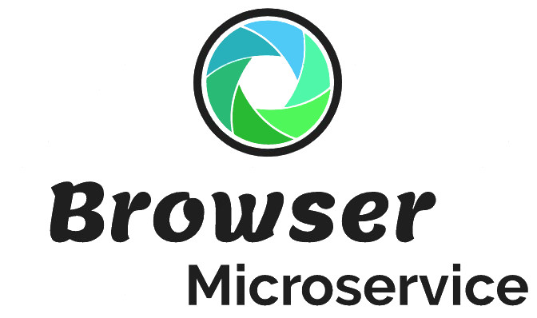

# BrowserMicroservice


[](https://github.com/ManuelK2000/BrowserMicroservice/releases)
[](https://www.apache.org/licenses/LICENSE-2.0)

Fast, robust and scalable self-hosted microservice for taking website screenshots.

<div align="center">
  
</div>

## Getting started
This browser microservice can be used to make the functionalities of a web browser available to different clients via a REST API interface.

It offers the following **features**:
- Taking high quality screenshots of websites

## Documentation

### Configuration

When starting the application, it will first check if there exists an configuration file "config.yml". If this file doesn't exists, it will use the default configuration the config file will be created.

Below is the default config.yml file:

```yml
host: "127.0.0.1"
port: 7000
screenshots:
  defaultWidth: 1920
  defaultHeight: 1200
  defaultBrowserEngine: "CHROME"
```

If you want to use environment variables, you can include them by adding ```${env:PORT}```. Here is a full documentation about [config variables](https://commons.apache.org/proper/commons-text/apidocs/org/apache/commons/text/StringSubstitutor.html) using interpolation.

### API Interface

- #### Take screenshot
  **GET** ```localhost:7000/v1/screenshot/{url-encoded website url}```

  This request takes a simple screenshot of the given website and returns the image in the repsone.

## Links
- https://javalin.io/documentation
- https://www.selenium.dev/documentation/
- https://bonigarcia.dev/webdrivermanager/
- https://commons.apache.org/proper/commons-text/apidocs/org/apache/commons/text/StringSubstitutor.html